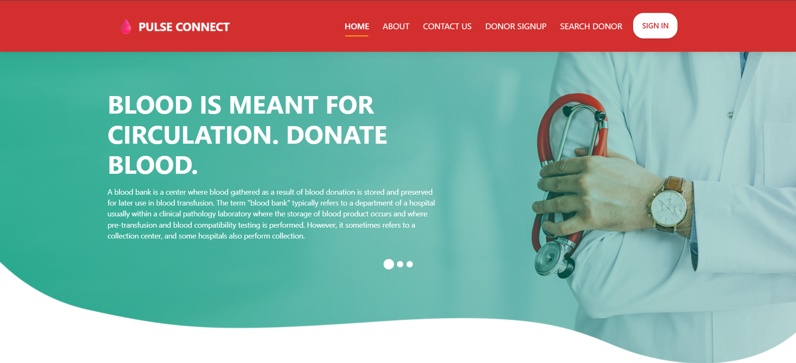

# MD BAYZID's Blood Donor Management System

## Table of Contents

- [Overview](#overview)

  - [Screenshot](#screenshot)
  - [Links](#links)

- [My Process](#my-process)

  - [Built With](#built-with)

- [How to Use](#how-to-use)
- [Make It Your Own](#make-it-your-own)
- [Deploy on Vercel](#deploy-on-vercel)
- [Use Your Own Email API](#use-your-own-email-api)
- [Author](#author)

---

## Overview

### Screenshot



### Links

- **Live Demo**: [https://your-demo-link.vercel.app](https://your-demo-link.vercel.app)

---

## My Process

### Built With

- [Python](https://www.python.org/) – Programming Language
- [Django](https://www.djangoproject.com/) – Web Framework
- [SQLite3](https://www.sqlite.org/index.html) – Database
- [HTML5](https://developer.mozilla.org/en-US/docs/Web/HTML) – Markup
- [CSS3](https://developer.mozilla.org/en-US/docs/Web/CSS) – Styling
- [JavaScript](https://developer.mozilla.org/en-US/docs/Web/JavaScript) – Client-Side Logic
- [jQuery](https://jquery.com/) – DOM Manipulation
- [Bootstrap](https://getbootstrap.com/) – Styling Framework
- Plugins: FontAwesome, Summernote, Select2, DataTables, Owl Carousel

---

## How to Use

1. **Clone** the repository:

   ```bash
   git clone git@github.com:bayzidalways/blood-donor.git
   cd bayzidalways-blood-donor
   ```

2. **Create and activate a virtual environment**:

   ```bash
   python -m venv venv
   source venv/bin/activate  # On Windows: venv\Scripts\activate
   ```

3. **Install dependencies**:

   ```bash
   pip install -r requirements.txt
   ```

4. **Apply migrations**:

   ```bash
   python manage.py makemigrations
   python manage.py migrate
   ```

5. **Create a superuser**:

   ```bash
   python manage.py createsuperuser
   ```

6. **Run the development server**:

   ```bash
   python manage.py runserver
   ```

7. Open your browser and go to [http://127.0.0.1:8000](http://127.0.0.1:8000)

---

## Make It Your Own

This project was built to be easily customizable:

- Update your models in `bbdmsapp/models.py`
- Customize views and logic in `bbdmsapp/views.py`
- Modify the HTML templates in `/templates`
- Static files are located in `/static`, media uploads in `/media`

---

## Deploy on Vercel

Although Django is typically hosted on platforms like Heroku or Render, you can deploy using \[Vercel + Django + Serverless Functions] with proper configuration.

> 🔥 For now, consider using **Render** or **Railway** for the easiest Django deployments.

---

## Use Your Own Email API

To connect contact forms or notifications via email:

1. Set up a custom email backend using SMTP or a third-party service.
2. Modify the email sending logic in Django:

   - In `settings.py`, configure:

     ```python
     EMAIL_BACKEND = 'django.core.mail.backends.smtp.EmailBackend'
     EMAIL_HOST = 'smtp.gmail.com'
     EMAIL_PORT = 587
     EMAIL_HOST_USER = 'your-email@gmail.com'
     EMAIL_HOST_PASSWORD = 'your-app-password'
     EMAIL_USE_TLS = True
     ```

3. Use `send_mail` or `EmailMessage` in your views to send messages.

---

## Author

- Website – [MD BAYZID](#)
- LinkedIn – [@MD BAYZID](https://www.linkedin.com/in/md-bayzid-211b67345)
- GitHub – [@bayzidalways](https://github.com/bayzidalways)
- Email – [bayzidalways@gmail.com](mailto:bayzidalways@gmail.com)

---
